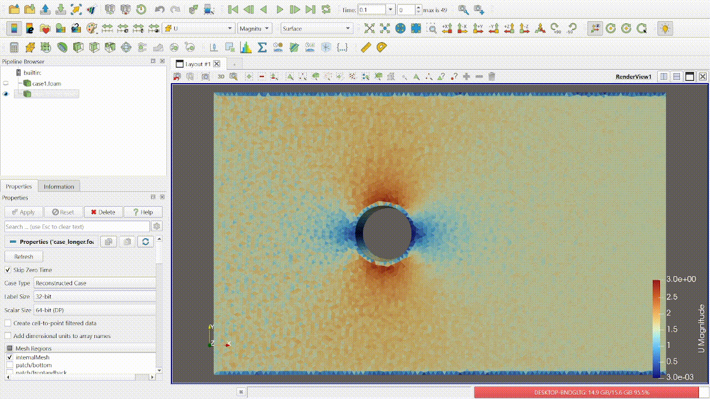
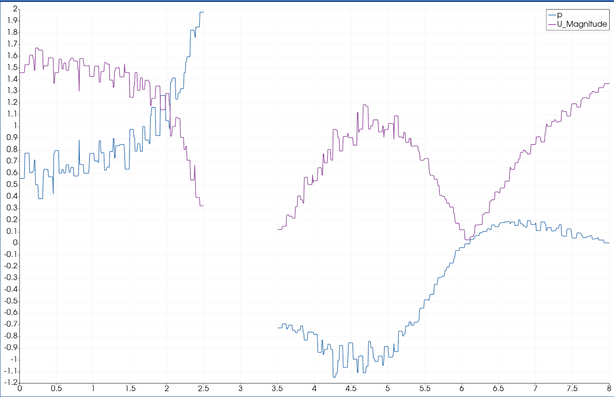

# Visualizing-the-flow-around-a-cylinder-with-OpenFoam-Gmsh
Simulation and visualization of a laminar(low Reynolds Number) flow around a circular cylinder using OpenFOAM ,specifically with icoFoam Solver. The Mesh was generated with Gmsh and results visualized in ParaView.

## Steps Taken

1. Creating the geometry of the Mesh
   - Created 4 points with lines to form a rectangle.
   - Created 5 points in a circle shape connected with the Arc function.
   

2. Extruding the mesh to create a 3D volume.

3. Add Physical group for each side of the mesh (e.g., top, bottom, left, right, inlet, outlet).

4. Run the Mesh as 3D and Export as `.msh` format (Version 2).

5. Opening OpenFoam Copied the directory from `$FOAM_TUTORIALS/incompressible/icoFoam/cavity/cavity`.

6. Convert the mesh by running the command: `gmshToFoam`.

7. Modify the boundary conditions for the Files:  pressure p and velocity U.

8. Run the simulation
   - Executed `icoFoam`.
   - Ran `touch case.foam` to prepare for visualization.

9. Visualization  in ParaView.
   

10. Using the "Plot Over Line" filter to generate graph of Velocity (U) and Pressure (p).
    

