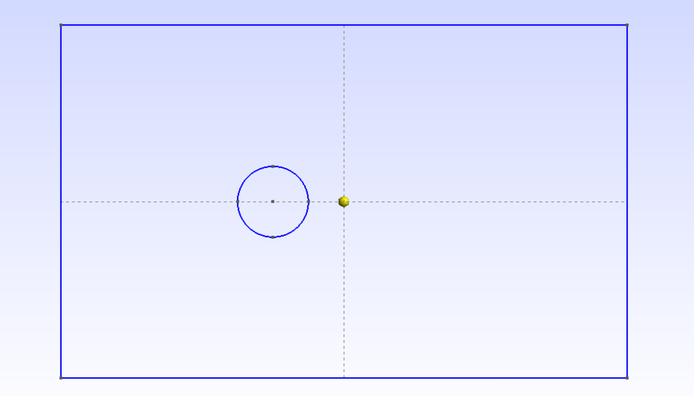

# Visualizing-the-flow-around-a-cylinder-with-OpenFoam-Gmsh
Simulation and visualization of a laminar(low Reynolds Number) flow around a circular cylinder using OpenFOAM ,specifically with icoFoam Solver. The Mesh was generated with Gmsh and results visualized in ParaView.

Steps taken: 

    1.Creating the geometry of the Mesh in Gmsh:
        4 Points with lines in between to create a rectangle
        5 points in the form of a circle connected with the Arc function

:
    2.Extruding the mesh
    3.Adding Physical Groups for each side of the Mesh for example : top, bottom, left, right ...
    4.put the Mush in 3D and Export as msh version 2
    5.Open OpenFoam and copy the directory of $FOAM_TUTORIALS/incompressible/icoFoam/cavity/cavity 
    6.run the function gmshToFoam
    7.Modify the boundary conditions of p and U
    8.Run icoFoam and do the command : touch case.foam and open the file in Paraview
    9.Visualize the data 
    10.Run the filter plot over Line to get a graph of U and p

